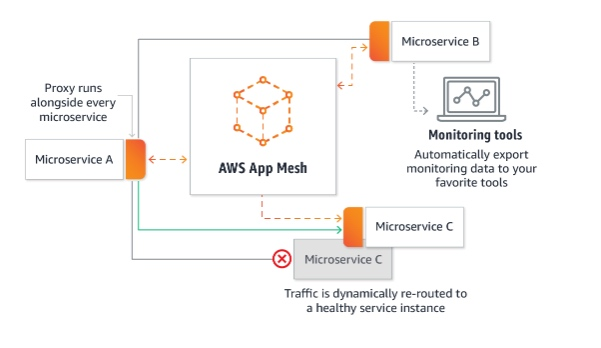

# AWS App Mesh
AWS APP Mesh 是 AWS 今年在 re:Invent 2018 大会上发布的一款新服务，旨在解决在 AWS 上运行的微服务的监控和控制问题。它主要标准化了微服务之间的通信流程，为用户提供了端到端的可视化界面，并且帮助用户应用实现高可用。App Mesh 使用开源的 Envoy 作为网络代理，这也使得它可以兼容一些开源的微服务监控工具。用户可以在 AWS ECS 和 Amazon EKS 上使用 App Mesh。

从官网放出的流程图可以看出，App Mesh 是对标 Istio。目前处于 GA 版本。
