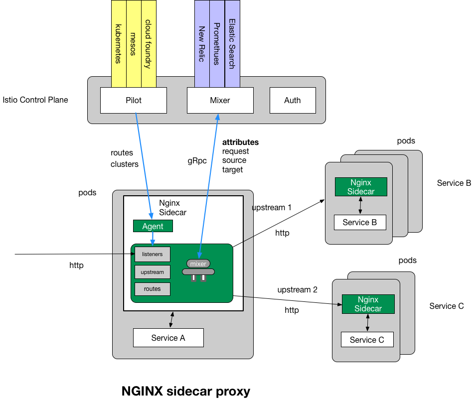

# Nginmesh
Nginmesh 是 NGINX 开源的一款适配 Istio 的 service mesh 方案，它使用 NGINX 作为 sidecar proxy。

从架构图上可以看到，它是作为 data plane 来替换 Envoy。在其他方面，比如接口、交互方式和流程上来说完全适配 Istio。但遗憾的是，Nginmesh 已不再研发和维护了。最新的代码可支持 Istio 0.7。

